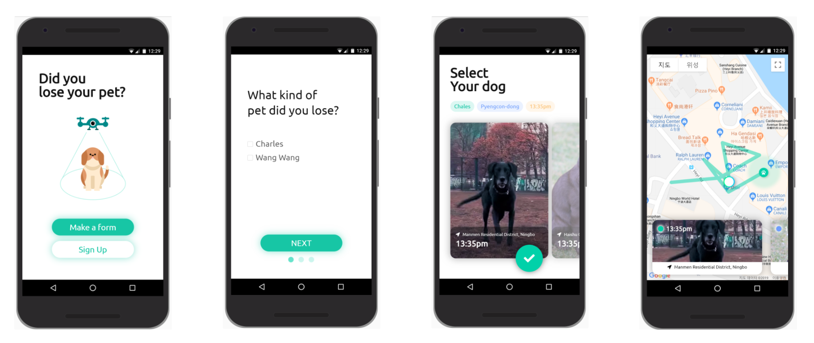

# 🐱 WeMeet 🐶

> Find your lost pet **instantly** with flying **drone** and **AI**

## 🏆 Prize

- 2019 Ningbo Open Source Space CN-KR Hackathon - Excellect Work

## 🐱 Team **WICO**

- 김지은 - Backend & AI
- 강지인 - Design
- 이건 - Frontend
- 최준식 - Backend
- 한준모 - AI

## 🗂 Presentation

## Problem

- Korea
  - The large number of lost pets
    - 250 pets / 1day
    - 91K pets / 1year
  - Shelters for them needed
  - 46% of them are died (euthanasia)
- China
  - (Shanghai) pet registration system
    - However, 80% of pets are NOT registered.
    - Cannot come back
  - Shelters for them needed
  - Pets in the street attack citizen.

> Lost pets are incur a lot of cost for caring and management, damage people, and have ethical issue.

## Cause of the Problem

- A lack of platforms helping the owners find their lost pets faster.
  - leaflet, search by police officer
- In the result, miss the \*gloden time and fail to find their pets.

> **Golden time** (3 hours)
> : the time period following a pet loss where searching the pet has the highest chance of finding it out successfully.

## Solution

- Find lost pets faster, within the **golden time**
- with flying drone and AI.

## Value of WeMeet

- Cost reduction
  - Reduce social costs (lost pets management and protection costs)
- Efficiency
  - Less human resources needed

## Scenario

- Send find request
- Drone starts search
- Drone view images are transferred in real time to Tensorflow
- Detect dogs or cats
- Check similarity
- Send detected & similar pet's image and location to owner
- Check tracking situation in App
- Go to location where pet is, Meet a pet

## Future

- Cost reduction
- Reduced number of lost pets
- Less human resources
- More seamless with 5G
